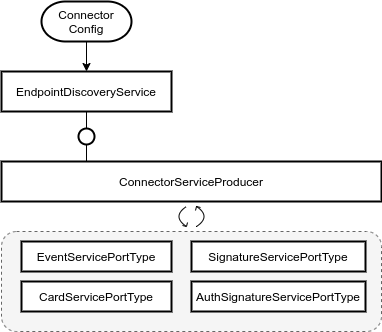

# Connector Service Producer

This page should give a brief introduction how the set up of the SOAP services provided by the connector should work.

## Overview



## Connector Service Producer Class

```
@ApplicationScoped
public class ConnectorServiceProducer {

   @Inject
   EndpointDiscoveryService endpointDiscoveryService;

   ...

   @Produces
   public EventServicePortType produceEventServicePortType() {
       // Create EventServicePortType
       // ...
   }

   @Produces
   public SignatureServicePortType produceEventServicePortType() {
       // Create SignatureServicePortType
       // ...
   }

   @Produces
   public CertificateServicePortType produceEventServicePortType() {
       // Create CertificateServicePortType
       // ...
   }
   ...
}

```

https://docs.jboss.org/weld/reference/1.0.0/en-US/html/producermethods.html

## Usage

Here is an example usage:

```
public class ERezeptWorflowService {
    @Inject
    EventServicePortType eventServicePortType;
    // ...
} 

```