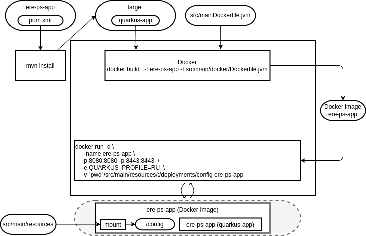

# Docker for ere-ps-app

ere-ps-app can be run in a docker image. The architecture of the docker image is shown here:



The action to build and run the docker container are in the following file:

https://github.com/ere-health/ere-ps-app/blob/main/build-and-run-docker-image.sh

The file is a bash script that can be run on a Linux machine. Here are the steps including a description what they are doing:

```bash
docker rm ere-ps-app
```

Delete the docker image ere-ps-app if it was already created.

```bash
docker build . -t ere-ps-app -f src/main/docker/Dockerfile.jvm
```

Build the docker image ere-ps-app from the Dockerfile.jvm in the src/main/docker directory.

Arguments:
 * -t ere-ps-app: Tag the image with the name ere-ps-app
 * -f src/main/docker/Dockerfile.jvm: Use the Dockerfile.jvm as the Dockerfile

The Docker file can be found here:
https://github.com/ere-health/ere-ps-app/blob/main/src/main/docker/Dockerfile.jvm

It uses registry.access.redhat.com/ubi8/ubi-minimal:8.3 as base image and installs the following packages:

 * Java JDK
 * ca-certificates
 * run-java.sh from https://repo1.maven.org/maven2/io/fabric8/run-java-sh/1.3.8/run-java-sh-1.3.8-sh.sh
 ** Documentation can be found here: https://github.com/fabric8io-images/run-java-sh

It exposes port 8080 and 8443.

It runs the application as user 1001.

You can run the docker image with the following command:

```bash
docker run -d \
    --name ere-ps-app \
    -p 8080:8080 -p 8443:8443  \
    -e QUARKUS_PROFILE=RU  \
    -v `pwd`/src/main/resources/:/deployments/config ere-ps-app
```

This runs the docker image in the background.

Arguments:
 * -d Run the container in the background
 * -p 8080:8080 -p 8443:8443 Expose the ports 8080 and 8443 to the host
 * -e QUARKUS_PROFILE=RU Set the environment variable QUARKUS_PROFILE to RU, this will read all %RU entries in the application.properties file
 * -v `pwd`/src/main/resources/:/deployments/config Mount the src/main/resources directory to the /deployments/config directory in the container

In the end the script will print some control commands for docker:

 * Status with: 'docker ps'
 * Logs with: 'docker logs ere-ps-app'
 * Kill with: 'docker kill ere-ps-app'