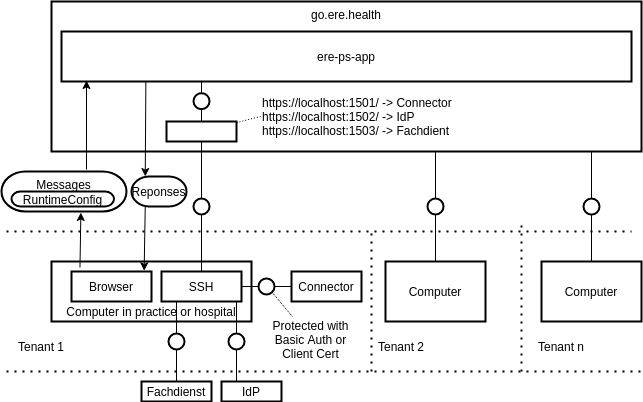

# https://go.ere.health

https://go.ere.health is ere.health as a Software-as-a-Service offering. The main benefit:

 * No software installation required

How does this work?

We are assigning every tenant 3 ports that they have to connect via SSH Remote Port forwarding with the following services:

 1. Connector
 2. IdP
 3. Fachdienst

We are making sure that the connector can only be used by the specified tenant by securing it with Basic Authentification or SSL Certificates and these certificates are only stored in the local storage of their local browsers. The main system is not storing and data but just processing it and returning it to the different services.