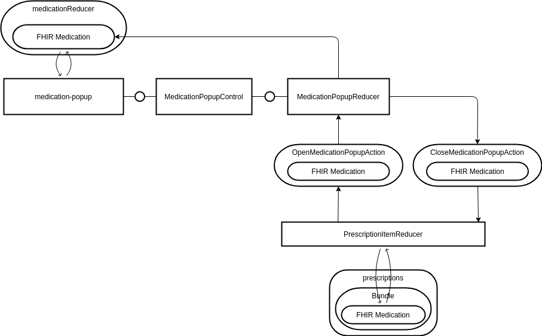

# Medication Popup

This page gives a brief overview about how the 4 different medication profiles (Freetext, PZN, Ingredient and Compounding) are implemented in the Frontend.

## Redux store implementation

The medication popup is implemented as own web component that can retrieve a FHIR medication JavaScript object and that can "return" a JavaScript medication object. 