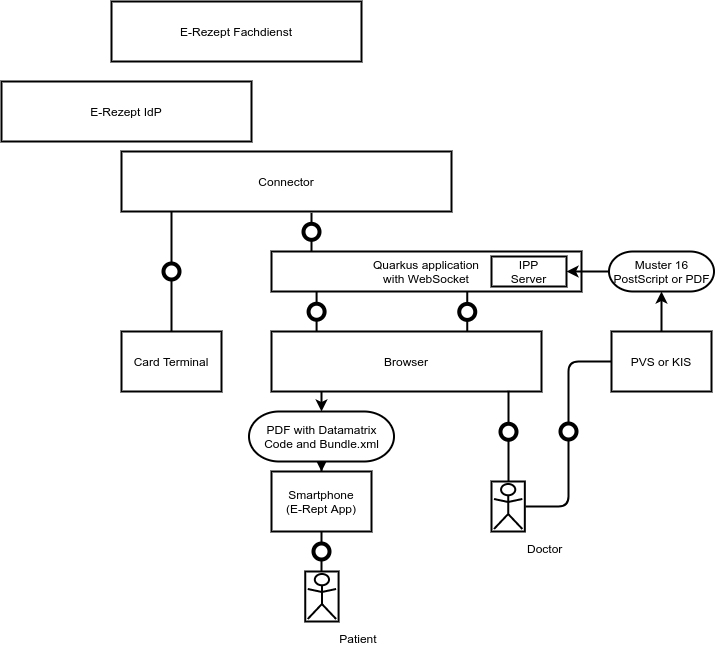
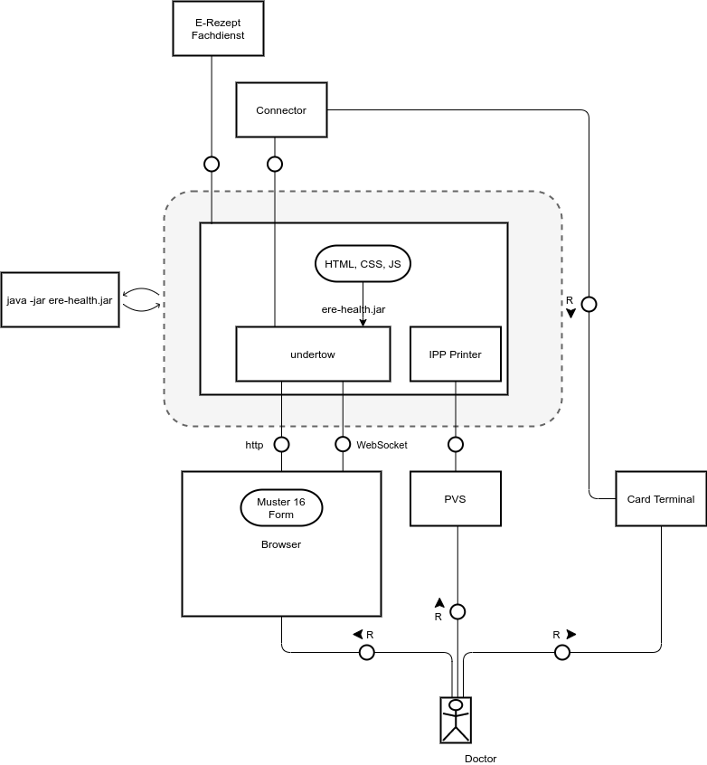
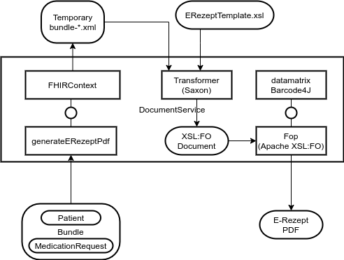
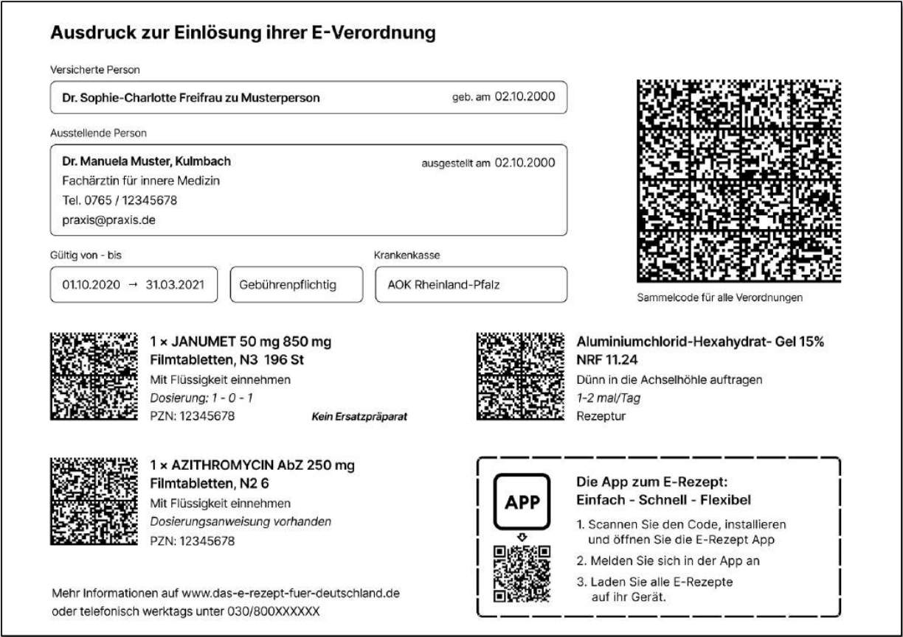
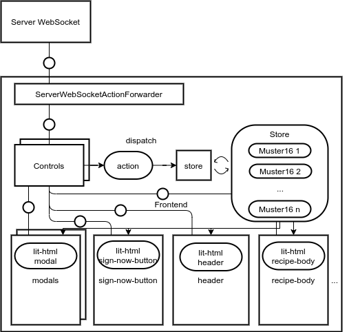
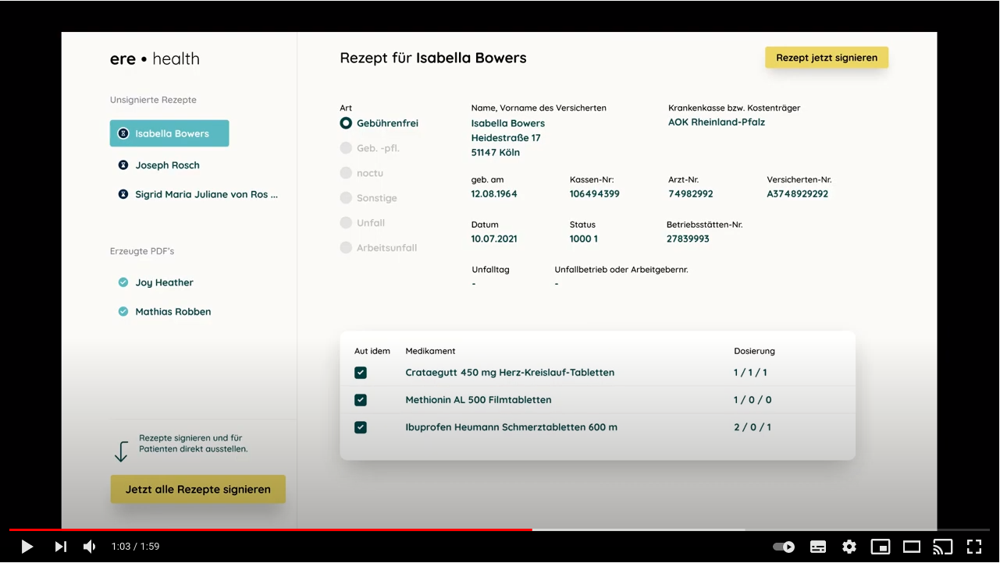
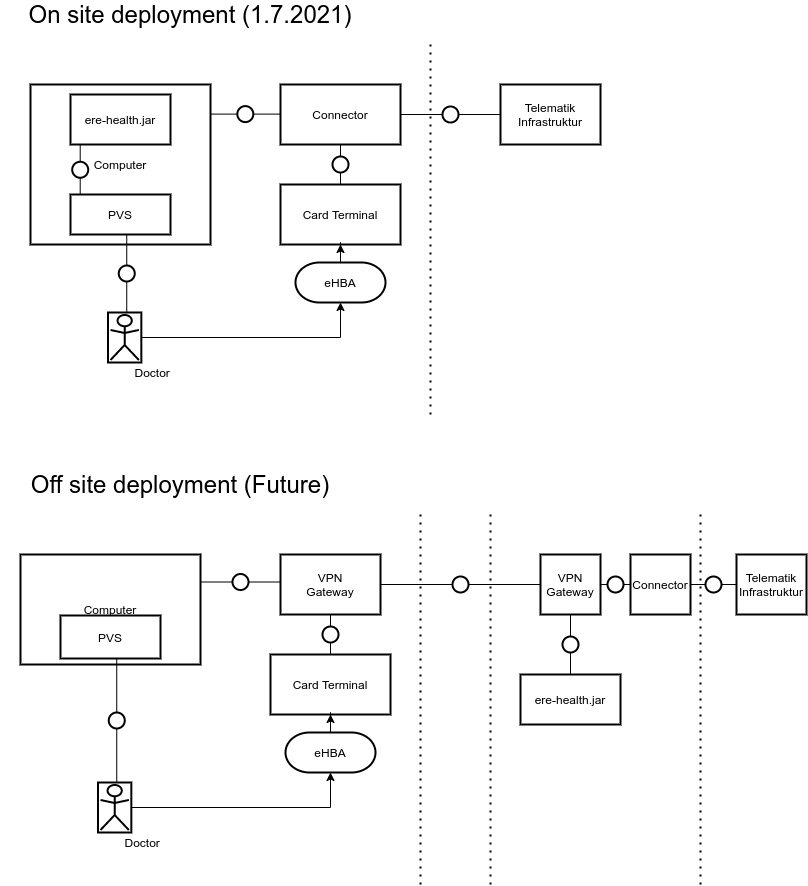
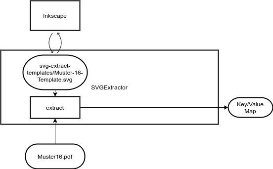
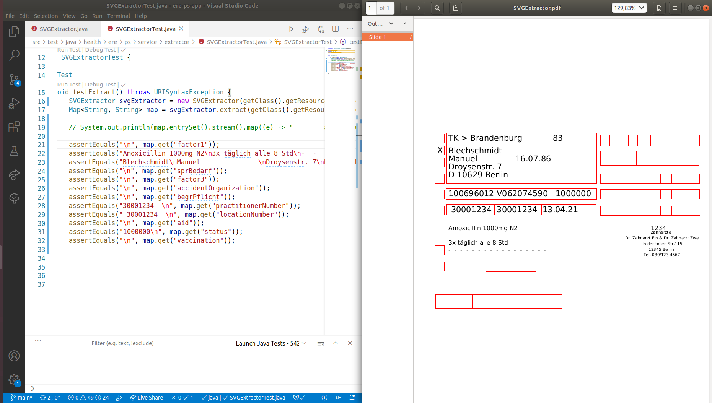
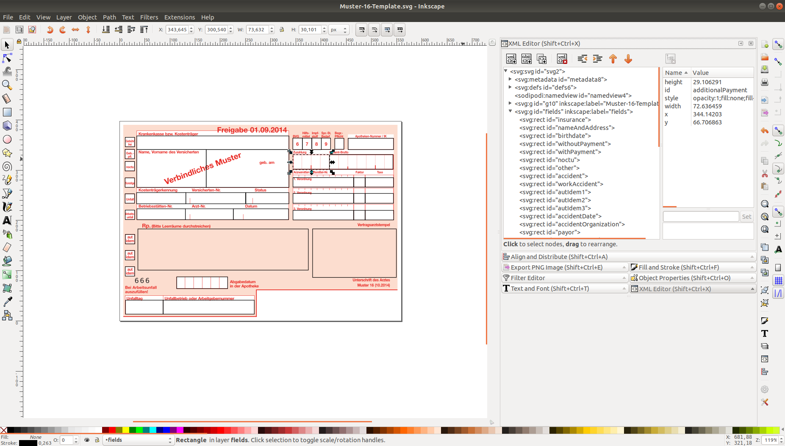

# Requirements ere.health virtual E-Rezept printer

Vision: Enable as many doctors and clinics as possible to prescribe E-Rezepts to patients so that the patients don't need to fetch the prescriptions anymore from a physical location.

Mission: Develop an open source solution that is commercially supported together with typical actors around the E-Rezept and interested parties.

# Architecture

 1. The ere.health software should have two parts:  
   1.1. a virtual printer based on the IPP procotol [RFC 8010](https://tools.ietf.org/html/rfc8010) and [RFC 8011](https://tools.ietf.org/html/rfc8011)  
   1.2. a browser application to review the E-Rezept and sign them in a batch run containing 1 and up to 100 E-Rezepts
 2. It should require as little installation on the client PCs as possible at most a browser application and some configuration
 3. It should be compatible with all systems that can print a [Muster 16 Formular](https://www.kbv.de/html/27760.php)
 4. It should be done at 2021-07-01

# Backend

The diagram above shows the backend application which is a single quarkus jar communicating via a WebSocket with the frontend and via the SOAP interface with the connector (The IdP is missing on the picture)

## Backend - Document Service

Above the backend architecture is shown. This will in the end create the following document:

# Frontend

The diagram above shows how to distribute the different components to [BElement](https://github.com/AdamBien/bce.design/blob/main/app/src/BElement.js).

 1. Use the lean framework [BCE Design from Adam Bien](https://github.com/AdamBien/bce.design)  
   1.1. [lit-html](https://lit-html.polymer-project.org)  
   1.2. [redux toolkit](https://redux-toolkit.js.org)  
   1.3. [vaadin router](https://vaadin.com/router) (suggestion / optional)  
   1.4. [rollup](https://rollupjs.org/) (for updates / optional)  

# Video

Here is a german YouTube video that shows how this works: 

# Deployment

The diagram above shows the deployment options. In the first generation we are planning to deploy the ere.health software as normal installable service on the doctors personal computer.

The second generation is fully hostable in a specially secured data center with a site-2-site VPN connection. This makes is possible to also sign prescriptions from anywhere in the world as long as the card reader is connected somewhere to the internet and the Komforsignatur is enabled.

# SVG Extractor

The image above shows the implementation details of the SVG extractor. It takes a SVG file and extracts all the text that is contained by a rectangle on the fields layer into a java map.

## Debug view

The above image shows a generate debug pdf to see what text is extracted.

## Inkscape view

The above image shows how the template can be modified in inkscape.

# Links:

 * [E-Rezept API-Dokumentation](https://github.com/gematik/api-erp)
 * [Implementierungs­­leitfaden Primär­­systeme – E-Rezept](https://fachportal.gematik.de/fileadmin/Fachportal/Downloadcenter/Implementierungsleitfaeden/gemILF_PS_eRp_V1.2.0.pdf)
