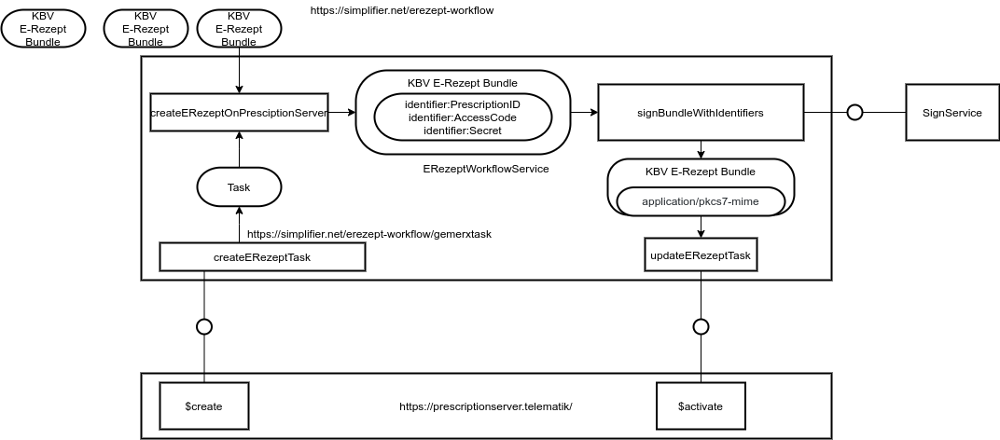

# Requirements ere.health virtual E-Rezept printer

Vision: Enable as many doctors and clinics as possible to prescribe E-Rezepts to patients so that the patients don't need to fetch the prescriptions anymore from a physical location.

Mission: Develop an open source solution that is commercially supported together with typical actors around the E-Rezept and interested parties.

# Architecture

 1. The ere.health software should have two parts:  
   1.1. a virtual printer based on the IPP procotol [RFC 8010](https://tools.ietf.org/html/rfc8010) and [RFC 8011](https://tools.ietf.org/html/rfc8011)  
   1.2. a browser application to review the E-Rezept and sign them in a batch run containing 1 and up to 100 E-Rezepts
 2. It should require as little installation on the client PCs as possible at most a browser application and some configuration
 3. It should be compatible with all systems that can print a [Muster 16 Formular](https://www.kbv.de/html/27760.php)
 4. It should be done at 2021-07-01

# E-Rezept process

The image above shows the technical process of how the different components are working together and how the ere-health solution creates an e prescription. It uses the BPMN notation.

# Backend

The diagram above shows the backend application which is a single quarkus jar communicating via a WebSocket with the frontend and via the SOAP interface with the connector (The IdP is missing on the picture)

## Backend - Internal structure

The diagram above shows the internal structure of the whole systems. There are 3 ways to get data in:

 1. [Using the VOS interface of the PVS systems](https://www.kbv.de/media/sp/KBV_ITA_VGEX_SST_Festlegung_VOS_V1.10.010.pdf)
 2. Putting a PDF file in a folder where is it automatically detected
 3. Directly printing into the system using an IPP printer interface

## Backend - Document Service

Above the document service is shown. This will in the end generate the following pdf document that includes the prescription as an attachement:

## Scanning with Gematik E-Rezept App

The image above shows how the Gematik E-Rezept app scans a data matrix code produced by the ere.health document service.

## E-Rezept Workflow

The image above shows how the E-Rezept service internally works.

## VAU Channel

The image above shows how the ere.health system implements the vau channel based on:

 * https://github.com/gematik/ref-ePA-vauchannel
 * https://github.com/resteasy/Resteasy/tree/main/resteasy-client/src/main/java/org/jboss/resteasy/client/jaxrs/engines

## Telematik API

The image above shows how the JAX-WS classes are generated from the official [gematik api-telematik](https://github.com/gematik/api-telematik) code. Which is [forked by ere-health](https://github.com/ere-health/api-telematik) and a pom.xml is added.

# Frontend

The diagram above shows how to distribute the different components to [BElement](https://github.com/AdamBien/bce.design/blob/main/app/src/BElement.js).

 1. Use the lean framework [BCE Design from Adam Bien](https://github.com/AdamBien/bce.design)  
   1.1. [lit-html](https://lit-html.polymer-project.org)  
   1.2. [redux toolkit](https://redux-toolkit.js.org)  
   1.3. [vaadin router](https://vaadin.com/router) (suggestion / optional)  
   1.4. [rollup](https://rollupjs.org/) (for updates / optional)  

The image above shows a screenshot of the frontend.

# Video

Here is a german YouTube video that shows how this works: 

# Deployment

The diagram above shows the deployment options. In the first generation we are planning to deploy the ere.health software as normal installable service on the doctors personal computer.

The second generation is fully hostable in a specially secured data center with a site-2-site VPN connection. This makes it possible to also sign prescriptions from anywhere in the world as long as the card reader is connected somewhere to the internet and the Komfortsignatur is enabled.

# SVG Extractor

The image above shows the implementation details of the SVG extractor. It takes a SVG file and extracts all the text that is contained by a rectangle on the fields layer into a java map.

## Debug view

The above image shows a generated debug pdf to see what text is extracted.

## Inkscape view

The above image shows how the template can be modified in inkscape.

# Links:

 * [E-Rezept API-Dokumentation](https://github.com/gematik/api-erp)
 * [Implementierungs­­leitfaden Primär­­systeme – E-Rezept](https://fachportal.gematik.de/fileadmin/Fachportal/Downloadcenter/Implementierungsleitfaeden/gemILF_PS_eRp_V1.2.0.pdf)
