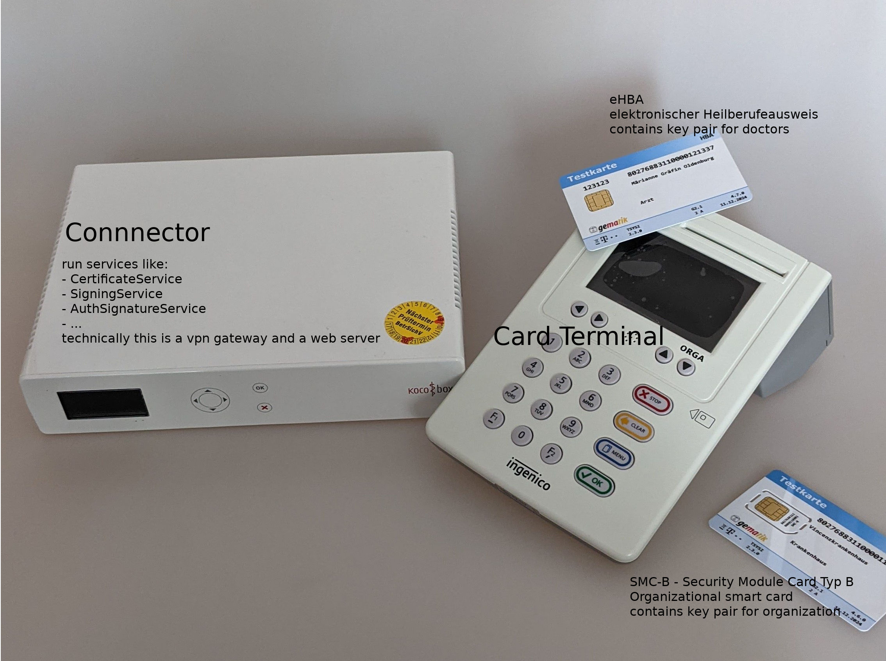
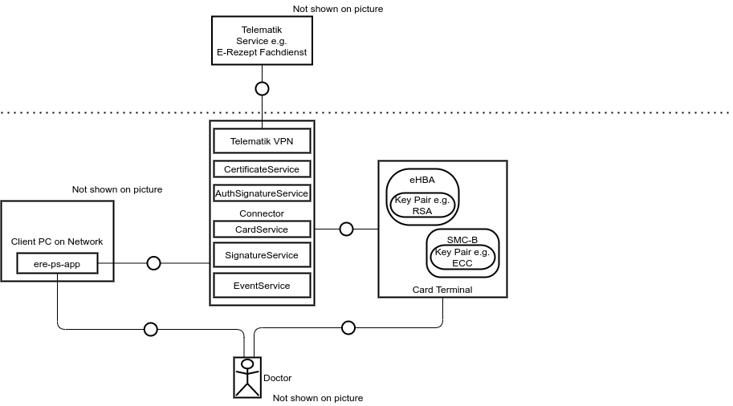

# Telematik

This page gives a brief overview about the set up of the telematik infrastructure in a doctors practice.

## Telematik Hardware

The image above shows the hardware of a Telematik set up. These components should be available at least once in every german hospital, pharmacy and practice.

### Card slots at terminal

The image above shows how the cards have to be inserted into the card terminal

## Telematik structure

The diagram above shows from a technical perspective how these systems do connect to each other and which system is running which services.

## Titus

[Titus](https://frontend.titus.ti-dienste.de/) simulates parts of the service that are running on the connector. Here are the URLs of the services that are shown in the image above:

 * CertificateService: https://kon-instanz2.titus.ti-dienste.de/soap-api/CertificateService/6.0.1
 * AuthSignatureService: https://kon-instanz2.titus.ti-dienste.de/soap-api/AuthSignatureService/7.4.1
 * CardService: https://kon-instanz2.titus.ti-dienste.de/soap-api/CardService/8.1.2
 * SignatureService: https://kon-instanz2.titus.ti-dienste.de/soap-api/SignatureService/7.5.4
 * EventService: https://kon-instanz2.titus.ti-dienste.de/soap-api/EventService/7.2.0
