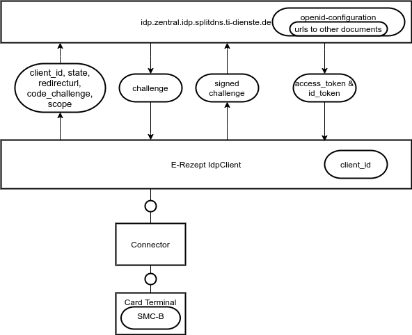
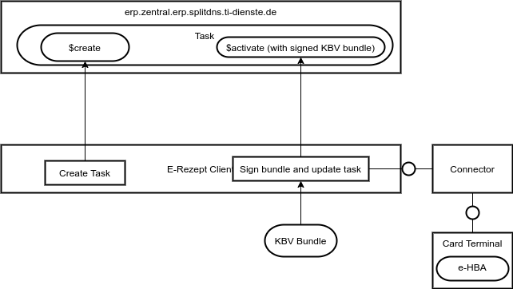
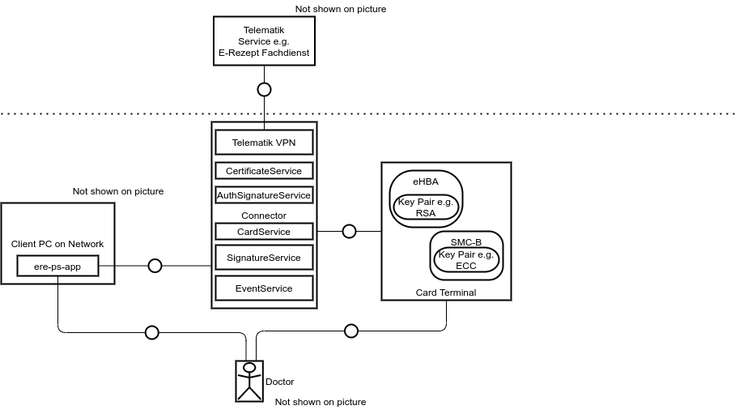

# E-Prescription Workshop

The Incentergy GmbH is offering an E-Prescription workshop for practice system vendors this workshops mainly covers 2 topics:

 1. How does the general E-Prescription systems works?
 1.1. Identity Provider (OpenID Connect)
 1.2. E-Rezept-Fachdienst (FHIR)
 2. How is it possible to implement these features into an own software e.g. ere.health?

# Identity Provider

The specified e-prescription uses an IdP that is based on the [open id connect procotol](https://openid.net/connect/). It is special in two concerns:

 1. All tokens are encrypted and signed
 2. The signature from the client is based on a certificated stored on an SMC-B

# E-Rezept-Fachdienst

The image above shows the two steps to create an e-prescription in the Fachdienst:

1. Create a Task using the $create method
2. Attach a signed KBV Bundle to the task using the $activate method

The E-Rezept Fachdienst is mainly a FHIR server.

# Connector Services

The E-Rezept requires multiple connector services. In this part we are going to explain the services and show how you can generate stubs using JAX-WS based on the [api-telematik structures](https://github.com/gematik/api-telematik/). 

# KBV Bundles

The E-Rezept documents are based on FHIR v4 Bundles shown here: https://simplifier.net/erezept

In this part we will look in detail in these structures how to create them using JSON or XML using open source technology like HAPI FHIR server and how to validate this data.

# Generation of PDF with FOP

In this part we will look into the flexibel generation of PDF files using [Apache FOP](https://xmlgraphics.apache.org/fop/).

# Integrate ere.health into your solution

In this part we are going to show you how you can integrate ere.health into you solution.