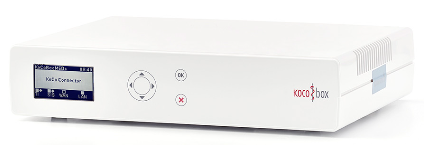
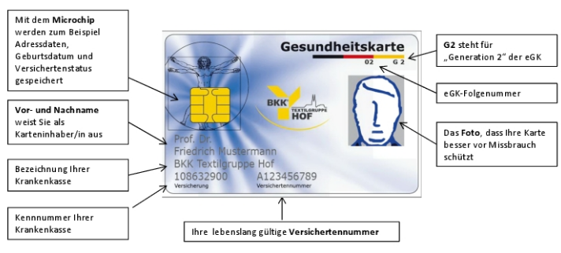
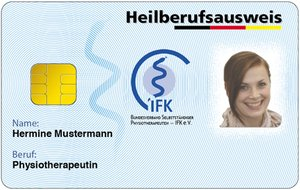
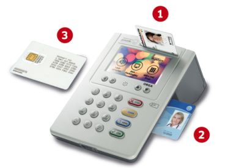
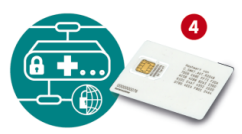
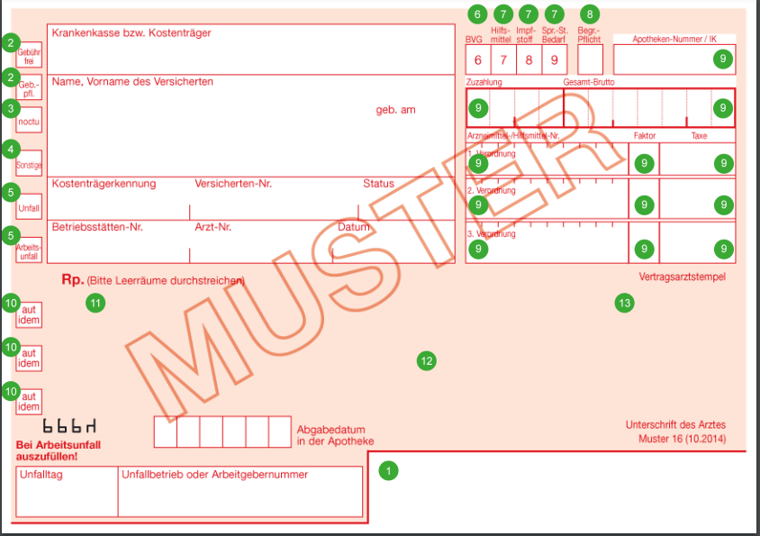
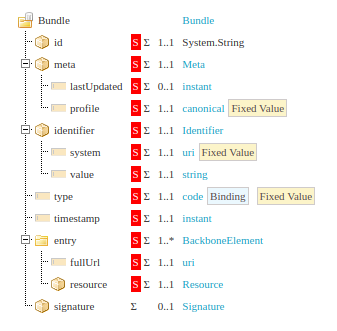

## ere.health Glossary

<table>
<colgroup><col style="width: 181.0px;"><col style="width: 779.0px;"></colgroup>
<tbody>
<tr><th>Expression</th><th>Explanation</th></tr>

<tr>
<td>Telematik</td>
<td>

Telematics is a combination of the words "telecommunications" and "computer science". It is the term used to describe the **networking of various IT systems** and the ability to link information from different sources with one another.

The backbone of the German digital healthcare system, supporting data communication between all stakeholders including insured patients, healthcare providers and insurers who pay for healthcare services
</td>
</tr>

<tr>
<td>

[TI](https://www.gematik.de/telematikinfrastruktur/)</td>
<td>

The [telematics infrastructure](https://www.gematik.de/glossar/begriffe/telematikinfrastruktur/6/) ( [TI](https://www.gematik.de/glossar/begriffe/telematikinfrastruktur/6/) ) networks **all players in the health care system** and guarantees the **secure exchange of information** across sectors and **systems** . It is a closed network to which only registered [users](https://www.gematik.de/glossar/begriffe/nutzer/6/) (persons or institutions) with an electronic health professional and practice card have access.
</td>
</tr>

<tr>
<td>

[Gematik](https://www.gematik.de/)</td>
<td>
Society for Telematics Applications of the eHealth Card, responsible for the construction, operation and maintenance of the TI. Founded in 2005, in 2019 it was taken over by Germany’s Federal Ministry of Health (BMG).
</td>
</tr>

<tr>
<td>

TI Connector 
TI Konnektor
</td>
<td>

a small box, technically a VPN gateway and a web server  
It plays a central role in the security of both the on-site IT infrastructure and the patient data that is exchanged within Telematic Infrastructure infrastructure, because it ensures the protected interaction between the software systems - at the doctor, dentist or psychotherapist, in hospital or pharmacy - and the e-health card terminals.

The TI Connector provides the following services:  
Telematik VPN, CertificateService, AuthSignatureService, CardService, SignatureService, EventService

</td>

</tr>

<tr>
<td>

[eGK](https://fachportal.gematik.de/karten-und-identitaeten/elektronische-gesundheitskarte)  
elektronische GesundheitsKarte
</td>
<td>

eHC - electronic health card - Personal health data stored securely  
It is the exclusive proof of health insurance for those with statutory health insurance. In the Telematics Infrastructure it serves as a decentralized memory for information from an insured person. This information is also available without an Internet connection.

</td>
</tr>

<tr>
<td>

[eHBA](https://fachportal.gematik.de/karten-und-identitaeten/elektronischer-heilberufsausweis)  
elektronischer HeilBerufsAusweis
</td>
<td>

electronic Health Professional ID card - a personal chip card in credit card format

</td>
</tr>

<tr>
<td>
eGK KartenTerminal
</td>
<td>

1 - eGK, 2 - eHBA or SMC-B, 3 - SMC-KT, 4 - SMC-K

</td>
</tr>

<tr>
<td>

[SMC-B karte](https://fachportal.gematik.de/karten-und-identitaeten/security-module-card-typ-b)  
Betriebsstättenkarte
</td>
<td>

Security Module Card - Type B: Business premises, medical facilities, institution card, electronic practice ID card

This card is inserted into the eGK card reader. It contains a key with which data on the eGK can be accessed. A second key and a certificate are used to identify and authenticate the connector and the practice at the TI. A third key and certificate are used to encrypt, decrypt and sign messages that are sent and received by the practice.  
A one-time PIN entry is required in the morning to activate the SMC-B card, which means that the card logs on to the connector and the TI.
</td>
</tr>

<tr>
<td>

[SMC-KT karte](https://fachportal.gematik.de/karten-und-identitaeten/geraetespezifische-sicherheitsmodulkarte-typ-kt)  
Security Module Card - KartenTerminal
</td>
<td>

Device-specific safety module card - Card Terminal  
Card installed into the eGK Card Terminal, it is the security module for TI card terminals with which the card reader is legitimised at the connector. Can be obtained from [ingenico Healthcare](https://www.ingenico.com/press-and-publications/library/brochures/healthcare/healthcare-borchure.html), together with the card reader.
</td>
</tr>

<tr>
<td>

[SMC-K karte](https://fachportal.gematik.de/karten-und-identitaeten/geraetespezifische-sicherheitsmodulkarte-typ-k)  
Security Module Card - Konnektor
</td>
<td>

Device-specific safety module card - Connector  
Card installed into the Connector, it is the Connector's security module with which the card reader is legitimised on the TI network. Can be obtained from  [medisign](https://www.medisign.de/), [Bundesdruckerei](https://www.bundesdruckerei.de/en/loesungen/SMC-B) and [T-Com](https://www.telekom-healthcare.com/klinik-it/telematik-gesundheitswesen/elektronischer-praxisausweis).
</td>
</tr>

<tr>
<td>

[Titus](https://fachportal.gematik.de/toolkit/titus-ps-testmodule)
</td>
<td>

The TI test and simulation environment for manufacturers of primary systems  
[Titus](https://frontend.titus.ti-dienste.de/) simulates parts of the service that are running on the Connector.
</td>
</tr>

<tr>
<td>

[KIM](https://fachportal.gematik.de/anwendungen/kommunikation-im-medizinwesen)  
Kommunikation im Medizinwesen
</td>
<td>

TI application for electronic communication in the medical sector  
Enables secure electronic data exchange between registered, authenticated users of the TI. This includes medical facilities such as practices, supply centers, hospitals, pharmacies as well as their respective interest groups and health insurance companies.  
Messages and documents can be exchanged quickly, reliably and securely with or without an attachment. The data can be relevant to treatment, therapy and billing.
</td>
</tr>

<tr>
<td>

KBV  
Kassenärztliche Bundesvereinigung
</td>

<td>

German National Association of Statutory Health Insurance Physicians  
The KBV ensures that a practice management system has all the functions that doctors need for a smooth practice operation. It lays down national standards and defines specifications for software functionalities.
</td>
</tr>

<tr>
<td>

[PVS](https://www.kbv.de/html/pvs.php)  
Praxisverwaltungs-system
</td>
<td>

PMS - Practice Management System  
The practice management system software is part of the basic equipment in every practice. It supports resident doctors and psychotherapists in the organization and documentation of practice tasks. All processes of an individual practice, a group practice, but also a medical care center can be mapped digitally. Doctors not only have functions such as the electronic patient file or online billing with the respective Association of Statutory Health Insurance Physicians. Scheduling, bookkeeping and electronic communication with colleagues are also essential components.
</td>
</tr>

<tr>
<td>

[KIS](https://de.wikipedia.org/wiki/Krankenhausinformationssystem)  
Krankenhaus-Informations-System
</td>
<td>

A **hospital information system** ( **HIS** ) is the class of all information processing systems in information technology for the acquisition, processing and transfer of medical and administrative data in the [hospital](https://de.wikipedia.org/wiki/Krankenhaus).
</td>
</tr>

<tr>
<td>

[E-Rezept](https://fachportal.gematik.de/anwendungen/elektronisches-rezept)

</td>
<td>

The **e-prescription** is created and signed exclusively digitally. Access to this via a prescription code can be digital or printed out. The e-prescription can be redeemed at any pharmacy. With the gematik e-prescription app, patients receive data protection-compliant and secure access to prescription data.

</td>
</tr>

<tr>
<td>

ePA  
elektronische PatientenAkte  
EHR
</td>

<td>

electronic patient health record  
It enables comprehensive digital connectivity within the German healthcare system, between patients and service providers, in both hospital settings and primary care. The ePA is embedded into the telematics infrastructure. From a patient’s perspective the ePA is a new central storage location for all their data in the German healthcare system, which the 105 health sickness funds must make available to the people they insure.
</td>
</tr>

<tr>
<td>

eMP  
elektronischer MedikationsPlan

</td>
<td>
electronic medication plan
</td>
</tr>

<tr>
<td>
open source
</td>
<td>

Open source is a term that originally referred to open source software (OSS). Open source software is code that is designed to be publicly accessible—anyone can see, modify, and distribute the code as they see fit.  
An open source development model is the process used by an open source community project to develop open source software. The software is then released under an open source license, so anyone can view or modify the source code. 

Many open source projects are hosted on [GitHub](https://github.com/explore), where you can access repositories or get involved in community projects. [Linux®](https://www.redhat.com/en/topics/linux), Ansible, and Kubernetes are examples of popular open source projects. 
</td>
</tr>

<tr>
<td>

[Java 11](https://openjdk.java.net/projects/jdk/11/)

</td>

<td>

**Java** is a [high-level](https://en.wikipedia.org/wiki/High-level_programming_language), [class-based](https://en.wikipedia.org/wiki/Class-based_programming), [object-oriented](https://en.wikipedia.org/wiki/Object-oriented_programming) [programming language](https://en.wikipedia.org/wiki/Programming_language)  
**11** refers to major version release with Long Term Support (4 years from September 2018)
</td>
</tr>

<tr>
<td>

[Quarkus](https://quarkus.io/)
</td>

<td>

A Kubernetes Native **Java stack** tailored for OpenJDK HotSpot and GraalVM, crafted from the best of breed Java libraries and standards.
</td>
</tr>

<tr>
<td>

[websocket](https://en.wikipedia.org/wiki/WebSocket)
</td>
<td>

**WebSocket** is a computer [communications protocol](https://en.wikipedia.org/wiki/Communications_protocol), providing [full-duplex](https://en.wikipedia.org/wiki/Full-duplex) communication channels over a single [TCP](https://en.wikipedia.org/wiki/Transmission_Control_Protocol) connection. The WebSocket protocol enables two-way interaction between a [web browser](https://en.wikipedia.org/wiki/Web_browser) (or other client application) and a [web server](https://en.wikipedia.org/wiki/Web_server).
</td>

</tr>

<tr>

<td>

[muster 16](https://www.kbv.de/media/sp/Muster_16_102014.pdf)
</td>

<td>

Sample 16 is intended for the prescription of medication and bandages as well as aids with the exception of visual aids and hearing aids. The prescription form also applies for patient-related consultation hours.

</td>
</tr>

<tr>
<td>

E-Rezept [IdP](https://en.wikipedia.org/wiki/Identity_provider)

</td>
<td>

e-prescription **Identity Provider**  
The authentication for the use of the e-prescription takes place with the help of an identity provider. In the future, various IDP services will offer further authentication options for different user groups of the telematics infrastructure. 

</td>
</tr>

<tr>
<td>IPP server</td>
<td>

Internet Printing Protocol server  
It allows programs to send one or more print jobs to the printer or print server and perform administration such as querying the status of a printer, obtaining the status of print jobs, or cancelling individual print jobs.  
The ere.health software relies on a virtual printer based on the IPP procotol [RFC 8010](https://tools.ietf.org/html/rfc8010) and [RFC 8011](https://tools.ietf.org/html/rfc8011)
</td>
</tr>

<tr>
<td>

RU  
ReferenzUmgebung
</td>
<td>

The [**reference environment**](https://www.gematik.de/glossar/begriffe/referenzumgebung/397/) of the [telematics infrastructure](https://www.gematik.de/glossar/begriffe/telematikinfrastruktur/397/) enables manufacturers and providers to independently [test](https://www.gematik.de/glossar/begriffe/test/397/) their products against the [TI](https://www.gematik.de/glossar/begriffe/telematikinfrastruktur/397/) . Test procedures in the reference environment include proof-of-concept, specialist tests and developer tests.
</td>
</tr>

<tr>
<td>

[FHIR](https://simplifier.net/docs/aboutfhir/whatsfhir)
</td>
<td>

FHIR® – Fast Healthcare Interoperability Resources ([http://hl7.org/fhir](http://hl7.org/fhir) ) – is a next generation standards framework created by HL7\. FHIR solutions are built from a set of modular components called "Resources". These resources can easily be assembled into working systems that solve real world clinical and administrative problems at a fraction of the price of existing alternatives. FHIR is suitable for use in a wide variety of contexts – mobile phone apps, cloud communications, EHR-based data sharing, server communication in large institutional healthcare providers, and much more.
</td>
</tr>

<tr>
<td>

[VoSS](http://www.kbv.de/media/sp/KBV_ITA_VGEX_Verordnungssoftware_Schnittstellenfestlegung.pdf)  
VerOrdnungsSoftware-Schnittstelle
</td>
<td>

Prescription software interface  
The National Association of Statutory Health Insurance Physicians (KBV) has defined a uniform interface for changing drug prescription software. Practices will be able to replace the drug prescription module without having to change the entire PVS. The interface is based on the international, cross-sector and open [HL7 FHIR](http://hl7.org/fhir/STU3/) standard
</td>
</tr>
<tr>

<td>
E-Rezept Fachdienst
</td>
<td>

**e-prescription service** is mainly an FHIR server.  
The e-prescription specialist service is an open specialist application-specific service in the TI, which workflow implements the e-prescriptions.
</td>
</tr>

<tr>
<td>

[SVG](https://www.w3.org/Graphics/SVG/)
</td>
<td>

**Scalable Vector Graphics** (**SVG**) is an [Extensible Markup Language](https://en.wikipedia.org/wiki/Extensible_Markup_Language) (XML)-based [vector image format](https://en.wikipedia.org/wiki/Vector_image_format) for [two-dimensional](https://en.wikipedia.org/wiki/Two-dimensional) graphics with support for interactivity and animation.  
SVG images and their behaviors are defined in XML text files. This means that they can be [searched](https://en.wikipedia.org/wiki/Search_algorithm), [indexed](https://en.wikipedia.org/wiki/Subject_indexing), [scripted](https://en.wikipedia.org/wiki/Scripting_language), and [compressed](https://en.wikipedia.org/wiki/Data_compression), and can be [scaled](https://en.wikipedia.org/wiki/Scale_(ratio)) in size without loss of quality. As XML files, SVG images can be created and edited with any [text editor](https://en.wikipedia.org/wiki/Text_editor), as well as with [drawing software](https://en.wikipedia.org/wiki/Drawing_software). The most-used [web browsers](https://en.wikipedia.org/wiki/Web_browser) [render SVG files](https://en.wikipedia.org/wiki/Comparison_of_layout_engines_(Scalable_Vector_Graphics)).
</td>
</tr>

<tr>
<td>

[eRezept bundle](https://simplifier.net/erezept/kbvprerpbundle)</td>
<td>

ePrescription defined as an FHIR container for a collection of resources.
</td>
</tr>

</tbody>
</table>
